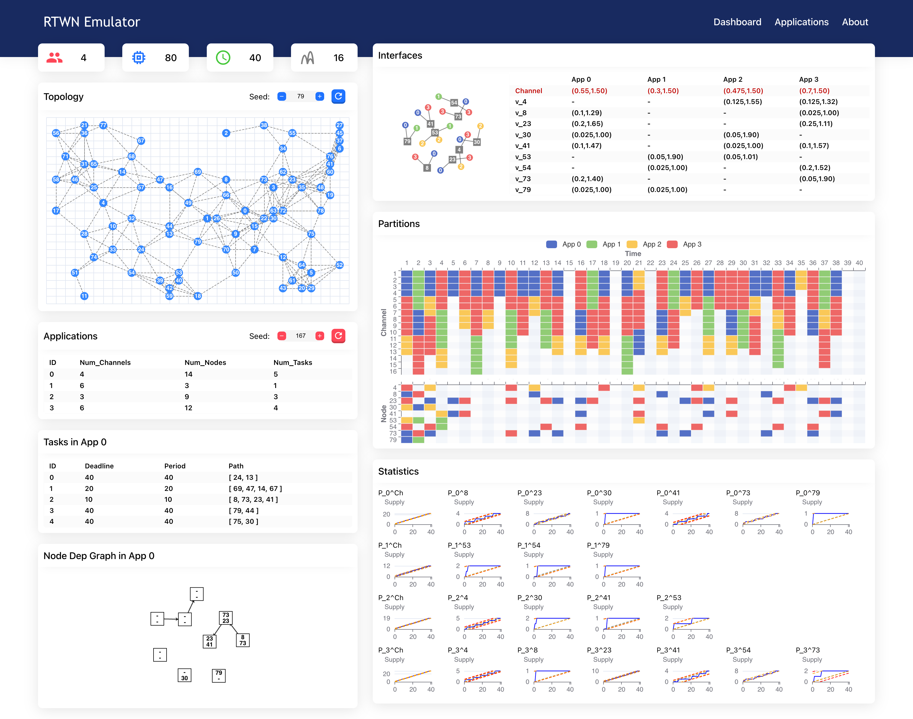

# RTWN Virtualization

RTWN simulator written in Go + Vue3 + TypeScript

## Usage

`go run .`

`cd frontend && npm run dev`

## References
[1] Jiachen Wang, Tianyu Zhang, Sharon Xiaobo Hu, Song Han, “Resource Virtualization with End-to-End Timing Guarantees for Multi-Hop Multi-Channel Real-Time Wireless Networks”, in the 44th Real-Time System Symposium (RTSS), 2023.